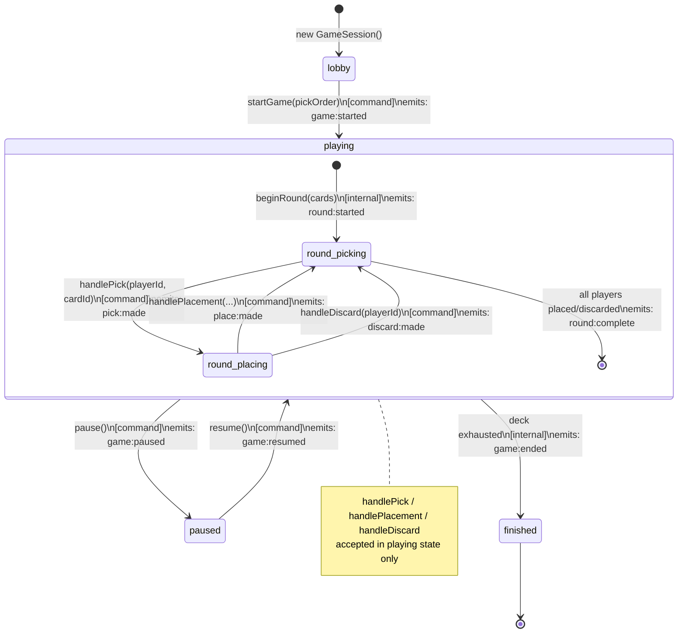

# Game Engine Package Extraction — Design Spec

**Date:** 2026-03-28  
**Status:** Draft  
**Scope:** Extract `GameSession` and game logic into independently packageable modules

---

## Problem

`GameSession`, `Player`, `Board`, `Round`, `Deal`, and all pure game-logic functions live inside `client/src/game/`. They have no strict public API boundary — the client can call anything, reach any internals, and there is no enforcement that player implementations (AI, local, remote) or transport concerns stay outside the game engine.

The goal is to give the game engine a **strict, documented API surface (command / query / observe)**, package it independently, and extract the cryptographic seed protocol as its own sibling package.

---

## Design Goals

1. `kingdomino-engine` npm workspace package — owns all game state and flow
2. `kingdomino-commitment` npm workspace package — owns the trusted seed protocol
3. `GameSession` drives its own game loop; the client is a thin coordinator
4. `GameEvent` is a named discriminated union — the single source of truth for all game events
5. `Player` has no `isLocal` flag — caller-identity is a session-level concept
6. No `endGame()` public command — game ends as a result of internal progression

---

## Architecture

### Package Layout

```
packages/
  kingdomino-engine/
    src/
      gamelogic/         ← pure functions (board, cards, scoring, utils)
      GameEvent.ts       ← named discriminated union of all in-game events
      GameSession.ts     ← orchestrator: state + flow loop
      GameEventBus.ts    ← typed pub/sub
      Player.ts          ← domain entity (id + Board, no isLocal)
      Board.ts
      Round.ts
      Deal.ts
      types.ts           ← PlayerId, CardId, Direction, etc.
    index.ts             ← single public barrel export
    package.json         ← name: "kingdomino-engine", zero React deps
    tsconfig.json

  kingdomino-commitment/
    src/
      SeedProvider.ts    ← interface: nextSeed(): Promise<number>
      CommitmentScheme.ts ← peer-to-peer commit/reveal protocol
      RandomSeedProvider.ts ← deterministic/random seed (solo + tests)
    index.ts
    package.json
    tsconfig.json

client/src/game/
  state/
    game.flow.ts         ← LobbyFlow (lobby-only: join, leave, start)
    ConnectionManager.ts ← wire protocol
    connection.solo.ts
    connection.multiplayer.ts
    connection.testing.ts
    game.messages.ts     ← ControlMessage only (START, COMMITTMENT, REVEAL, PAUSE/RESUME/EXIT)
    ai.player.ts         ← RandomAIPlayer
  visuals/               ← unchanged
```

### Dependency Direction

```
client/visuals
  ↓
client/game.flow (LobbyFlow)     →   kingdomino-commitment
  ↓                                  ↓
App/store.ts            →   kingdomino-engine
```

`kingdomino-engine` has zero dependencies on client code, React, or network transports.

---

## Event System

### Named Discriminated Union

Each event type is a named type; the union is the complete set of in-game events owned by `GameSession`:

```ts
export type GameStartedEvent   = { type: "game:started";   players: ReadonlyArray<Player>; pickOrder: ReadonlyArray<Player> };
export type RoundStartedEvent  = { type: "round:started";  round: Round };
export type PickMadeEvent      = { type: "pick:made";      player: Player; cardId: CardId };
export type PlaceMadeEvent     = { type: "place:made";     player: Player; cardId: CardId; x: number; y: number; direction: Direction };
export type DiscardMadeEvent   = { type: "discard:made";   player: Player; cardId: CardId };
export type RoundCompleteEvent = { type: "round:complete"; nextPickOrder: ReadonlyArray<Player> };
export type GamePausedEvent    = { type: "game:paused" };
export type GameResumedEvent   = { type: "game:resumed" };
export type GameEndedEvent     = { type: "game:ended";     scores: GameScore[] };

export type GameEvent =
  | GameStartedEvent
  | RoundStartedEvent
  | PickMadeEvent
  | PlaceMadeEvent
  | DiscardMadeEvent
  | RoundCompleteEvent
  | GamePausedEvent
  | GameResumedEvent
  | GameEndedEvent;
```

`player:joined` is removed — player registration is a lobby concern handled before `startGame()`.

### GameEventBus

`on()` is typed via the discriminated union:

```ts
export class GameEventBus {
  on<T extends GameEvent["type"]>(
    type: T,
    listener: (e: Extract<GameEvent, { type: T }>) => void
  ): () => void  // returns unsubscribe

  emit(event: GameEvent): void
}
```

---

## GameSession API

### Constructor

```ts
new GameSession({
  variant?: GameVariant;       // "standard" | "mighty-duel"
  bonuses?: GameBonuses;       // { middleKingdom?, harmony? }
  localPlayerId?: PlayerId;    // which player is "me" on this machine
  seedProvider: SeedProvider;  // from kingdomino-commitment
})
```

### GamePhase

```ts
export type GamePhase = "lobby" | "playing" | "paused" | "finished";
```

### Commands (mutations)

| Method | Phase | Description |
|--------|-------|-------------|
| `addPlayer(id: PlayerId): void` | lobby | Register a participant |
| `startGame(pickOrder: PlayerId[]): void` | lobby → playing | Begin the game; triggers internal round loop |
| `handlePick(playerId, cardId): void` | playing | Record a pick (from UI or peer) |
| `handleLocalPick(cardId): void` | playing | Convenience: pick for local player |
| `handlePlacement(playerId, x, y, direction): void` | playing | Record a placement |
| `handleLocalPlacement(x, y, direction): void` | playing | Convenience: place for local player |
| `handleDiscard(playerId): void` | playing | Record a discard (no valid placement) |
| `handleLocalDiscard(): void` | playing | Convenience: discard for local player |
| `pause(): void` | playing → paused | Emits `game:paused` |
| `resume(): void` | paused → playing | Emits `game:resumed` |

`beginRound()` and `endGame()` are **internal** — not part of the public API.

### Queries (reads)

| Property / Method | Returns |
|-------------------|---------|
| `phase` | `GamePhase` |
| `players` | `ReadonlyArray<Player>` |
| `currentRound` | `Round \| null` |
| `pickOrder` | `ReadonlyArray<Player>` |
| `playerById(id)` | `Player \| undefined` |
| `myPlayer()` | `Player \| undefined` (uses `localPlayerId`) |
| `hasEnoughPlayers()` | `boolean` |
| `isMyTurn()` | `boolean` |
| `isMyPlace()` | `boolean` |
| `localCardToPlace()` | `CardId \| undefined` |
| `localEligiblePositions()` | `Array<{x, y}>` |
| `localValidDirectionsAt(x, y)` | `Direction[]` |
| `hasLocalValidPlacement()` | `boolean` |
| `deal()` | `CardInfo[]` |
| `boardFor(playerId)` | `BoardGrid` |

### Observe (events)

```ts
session.events.on("pick:made", ({ player, cardId }) => { ... });
// etc. — all GameEvent types
```

### Internal Game Loop (`run()` / `startGame()`)

When `startGame()` is called, the session internally runs:

```
while (seedProvider can supply more seeds):
  seed = await seedProvider.nextSeed()
  cards = getNextFourCards(seed, remainingDeck)
  [start round, wait for round:complete]
→ emit game:ended
```

Pause/resume is handled inside the loop: if `game:paused` is emitted, the loop suspends until `game:resumed`.

---

## Player Changes

`Player` loses `isLocal`. It becomes a pure domain entity:

```ts
export class Player {
  constructor(readonly id: PlayerId) {}
  get board(): Board
  score(): number
  applyPlacement(cardId, x, y, direction): void
}
```

`GameSession` stores `localPlayerId` and uses it for all `local*` convenience methods.

**Migration:** All `new Player(id, isLocal)` callsites become `new Player(id)`. `isLocal` is passed as `localPlayerId` to `GameSession`.

---

## `kingdomino-commitment` Package

### SeedProvider Interface (re-exported from engine)

```ts
export interface SeedProvider {
  nextSeed(): Promise<number>;
}
```

### Implementations

| Class | Use Case |
|-------|----------|
| `CommitmentSeedProvider` | P2P fairness: commit/reveal scheme over any `IGameConnection` |
| `RandomSeedProvider` | Solo play + tests: deterministic or random local seed |

The commitment/reveal logic currently in `ConnectionManager` (`buildTrustedSeed`) migrates here.

---

## `game.messages.ts` Simplification

`MoveGameMessage` and `MovePayload` are **removed** — replaced by `GameEvent` types from the engine.  
What remains is renamed `ControlMessage`:

```ts
export type ControlMessage =
  | StartGameMessage          // START
  | CommittmentGameMessage    // COMMITTMENT
  | RevealGameMessage         // REVEAL
  | PauseRequestMessage       // CONTROL_PAUSE_REQUEST
  | PauseAckMessage           // CONTROL_PAUSE_ACK
  | ResumeRequestMessage      // CONTROL_RESUME_REQUEST
  | ResumeAckMessage          // CONTROL_RESUME_ACK
  | ExitRequestMessage        // CONTROL_EXIT_REQUEST
  | ExitAckMessage;           // CONTROL_EXIT_ACK
```

The `MOVE` message disappears because peer moves flow through `session.handlePick/handlePlacement` — the transport layer serializes/deserializes `PickMadeEvent` / `PlaceMadeEvent` / `DiscardMadeEvent` directly.

---

## LobbyFlow Simplification

After extraction, `LobbyFlow` becomes lobby-only:

```ts
class LobbyFlow {
  async run(connection: IGameConnection) {
    const session = new GameSession({
      variant, bonuses,
      localPlayerId: connection.peerIdentifiers.me,
      seedProvider: new CommitmentSeedProvider(connection),
    });

    session.addPlayer(new Player(connection.peerIdentifiers.me));
    session.addPlayer(new Player(connection.peerIdentifiers.them));
    adapter.setSession(session);
    adapter.setPhase("lobby");

    const result = await Promise.race([
      adapter.awaitStart().then(() => "start"),
      adapter.awaitLeave().then(() => "leave"),
    ]);
    if (result === "leave") { adapter.setPhase("splash"); return; }

    adapter.setPhase("game");
    const firstSeed = await connectionManager.buildTrustedSeed();
    const pickOrder = chooseOrderFromSeed(firstSeed, connection.peerIdentifiers);
    
    session.startGame(pickOrder); // engine takes over: deals rounds, ends game
    await waitForEvent(session.events, "game:ended");
    adapter.setPhase("ended");
  }
}
```

Pause/resume, round sequencing, and end detection all move into the engine.

---

## Game State Flow Diagram



---

## Migration Plan (Phased)

### Phase 1 — Workspace scaffolding
- Create `packages/kingdomino-engine/` and `packages/kingdomino-commitment/` with `package.json` + `tsconfig.json`
- Wire into root npm workspaces

### Phase 2 — Extract pure logic
- Move `client/src/game/gamelogic/` → `packages/kingdomino-engine/src/gamelogic/`
- Update client imports to use engine package

### Phase 3 — Extract state classes
- Move `Player`, `Board`, `Round`, `Deal`, `types.ts` → engine
- Move `GameSession`, `GameEventBus` → engine
- Rename `GameEventMap` → `GameEvent` (discriminated union)
- Remove `isLocal` from `Player`; add `localPlayerId` to `GameSession`

### Phase 4 — Engine-owned game loop
- Add `SeedProvider` interface to engine
- Add internal game loop to `GameSession` (called by `startGame()`)
- Remove `beginRound()` and `endGame()` from public API
- Add `pause()` and `resume()` commands

### Phase 5 — Extract commitment package
- Move `buildTrustedSeed` logic from `ConnectionManager` → `CommitmentSeedProvider`
- Create `RandomSeedProvider` for solo/test use
- `SoloConnection` and `TestConnection` use `RandomSeedProvider`

### Phase 6 — Simplify client
- Trim `LobbyFlow` to lobby-only
- Update `game.messages.ts` → `ControlMessage` (remove MOVE)
- Update `store.ts` to subscribe to `GameEvent` union
- Remove `game.messages.ts` MOVE handling from connection implementations

### Phase 7 — Verification
- All existing tests pass
- Engine package has no client imports
- Commitment package has no engine or client imports
- `endGame()` and `beginRound()` are private (no external callers)

---

## Testing Strategy

### `kingdomino-engine` tests
- All `session.test.ts`, `Round.test.ts`, scoring/board tests migrate into engine package
- Use `RandomSeedProvider` (deterministic) for `run()` tests
- No network, no React, no transport dependencies

### `kingdomino-commitment` tests
- Unit tests for commit/reveal scheme using in-process message passing
- `RandomSeedProvider` tested for determinism

### Client tests
- `game.flow.test.ts` tests `LobbyFlow` lobby behavior (join/leave/start)
- `TestConnection` implements `SeedProvider` via `RandomSeedProvider`
- Existing visual story tests (`RealGameRuleHarness`) use engine API directly

---

## What Does NOT Change

- Visual components (`visuals/`) — untouched
- `ConnectionManager` structure — loses `buildTrustedSeed()` (moves to commitment package)
- `SoloConnection` / `MultiplayerConnection` / `TestConnection` — stay in client
- `RandomAIPlayer` — stays in client
- `App.tsx`, `store.ts` signal-based reactive layer — minor update for `GameEvent` union
- Game rules (scoring, placement validation) — pure functions, just relocate
