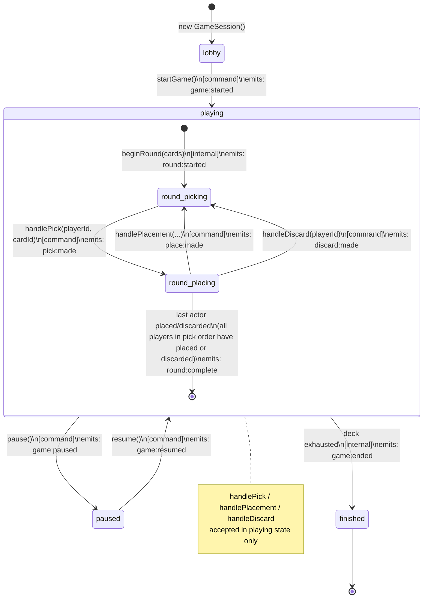

# Game Engine Package Extraction — Design Spec

**Date:** 2026-03-28  
**Status:** Draft  
**Scope:** Extract `GameSession` and game logic into independently packageable modules

---

## Problem

`GameSession`, `Player`, `Board`, `Round`, `Deal`, and all pure game-logic functions live inside `client/src/game/`. They have no strict public API boundary — the client can call anything, reach any internals, and there is no enforcement that player implementations (AI, local, remote) or transport concerns stay outside the game engine.

The goal is to give the game engine a **strict, documented API surface (command / query / observe)**, package it independently, and extract the cryptographic seed protocol as its own sibling package.

---

## Design Goals

1. `kingdomino-engine` npm workspace package — owns all game state and flow
2. `kingdomino-commitment` npm workspace package — owns the trusted seed protocol
3. `GameSession` drives its own game loop; the client is a thin coordinator
4. `GameEvent` is a named discriminated union — the single source of truth for all game events
5. `Player` has no `isLocal` flag — caller-identity is a session-level concept
6. No `endGame()` public command — game ends as a result of internal progression

---

## Architecture

### Package Layout

```
packages/
  kingdomino-engine/
    src/
      gamelogic/         ← pure functions (board, cards, scoring, utils)
      GameEvent.ts       ← named discriminated union of all in-game events
      GameSession.ts     ← orchestrator: state + flow loop
      GameEventBus.ts    ← typed pub/sub
      SeedProvider.ts    ← interface: nextSeed(): Promise<number> (re-exported by kingdomino-commitment)
      Player.ts          ← domain entity (id + Board, no isLocal)
      Board.ts
      Round.ts
      Deal.ts
      types.ts           ← PlayerId, CardId, Direction, etc.
    index.ts             ← single public barrel export
    package.json         ← name: "kingdomino-engine", zero React deps
    tsconfig.json

  kingdomino-commitment/
    src/
      CommitmentScheme.ts   ← peer-to-peer commit/reveal protocol
      RandomSeedProvider.ts ← deterministic/random seed (solo + tests)
      # SeedProvider interface lives in kingdomino-engine, re-exported here
    index.ts
    package.json
    tsconfig.json

client/src/game/
  state/
    game.flow.ts         ← LobbyFlow (lobby-only: join, leave, start)
    ConnectionManager.ts ← wire protocol
    connection.solo.ts
    connection.multiplayer.ts
    connection.testing.ts
    game.messages.ts     ← ControlMessage only (START, COMMITTMENT, REVEAL, PAUSE/RESUME/EXIT)
    ai.player.ts         ← RandomAIPlayer
  visuals/               ← unchanged
```

### Dependency Direction

```
client/visuals
  ↓
client/game.flow (LobbyFlow)     →   kingdomino-commitment
  ↓                                  ↓
App/store.ts            →   kingdomino-engine
```

`kingdomino-engine` has zero dependencies on client code, React, or network transports.

---

## Event System

### Named Discriminated Union

Each event type is a named type; the union is the complete set of in-game events owned by `GameSession`:

```ts
export type GameStartedEvent   = { type: "game:started";   players: ReadonlyArray<Player>; pickOrder: ReadonlyArray<Player> };
export type RoundStartedEvent  = { type: "round:started";  round: Round };
export type PickMadeEvent      = { type: "pick:made";      player: Player; cardId: CardId };
export type PlaceMadeEvent     = { type: "place:made";     player: Player; cardId: CardId; x: number; y: number; direction: Direction };
export type DiscardMadeEvent   = { type: "discard:made";   player: Player; cardId: CardId };
export type RoundCompleteEvent = { type: "round:complete"; nextPickOrder: ReadonlyArray<Player> };
export type GamePausedEvent    = { type: "game:paused" };
export type GameResumedEvent   = { type: "game:resumed" };
export type GameEndedEvent     = { type: "game:ended";     scores: GameScore[] };

export type GameEvent =
  | GameStartedEvent
  | RoundStartedEvent
  | PickMadeEvent
  | PlaceMadeEvent
  | DiscardMadeEvent
  | RoundCompleteEvent
  | GamePausedEvent
  | GameResumedEvent
  | GameEndedEvent;
```

`player:joined` is removed — player registration is a lobby concern handled before `startGame()`.

### GameEventBus

`on()` is typed via the discriminated union:

```ts
export class GameEventBus {
  on<T extends GameEvent["type"]>(
    type: T,
    listener: (e: Extract<GameEvent, { type: T }>) => void
  ): () => void  // returns unsubscribe

  emit(event: GameEvent): void
}
```

---

## GameSession API

### Constructor

```ts
new GameSession({
  variant?: GameVariant;       // "standard" | "mighty-duel"
  bonuses?: GameBonuses;       // { middleKingdom?, harmony? }
  localPlayerId?: PlayerId;    // which player is "me" on this machine
  seedProvider: SeedProvider;  // from kingdomino-commitment
})
```

### GamePhase

```ts
export type GamePhase = "lobby" | "playing" | "paused" | "finished";
```

### Commands (mutations)

| Method | Phase | Description |
|--------|-------|-------------|
| `addPlayer(player: Player): void` | lobby | Register a participant |
| `startGame(): void` | lobby → playing | Begin the game; engine uses first seed from `SeedProvider` to determine pick order, then triggers the internal round loop |
| `handlePick(playerId, cardId): void` | playing | Record a pick (from UI or peer) |
| `handleLocalPick(cardId): void` | playing | Convenience: pick for local player |
| `handlePlacement(playerId, x, y, direction): void` | playing | Record a placement. `cardId` is **not a parameter** — the engine tracks which card each player picked and derives it internally. |
| `handleLocalPlacement(x, y, direction): void` | playing | Convenience: place for local player |
| `handleDiscard(playerId): void` | playing | Record a discard (no valid placement) |
| `handleLocalDiscard(): void` | playing | Convenience: discard for local player |
| `pause(): void` | playing → paused | Emits `game:paused` |
| `resume(): void` | paused → playing | Emits `game:resumed` |

`beginRound()` and `endGame()` are **internal** — not part of the public API.

### Queries (reads)

| Property / Method | Returns |
|-------------------|---------|
| `phase` | `GamePhase` |
| `players` | `ReadonlyArray<Player>` |
| `currentRound` | `Round \| null` |
| `pickOrder` | `ReadonlyArray<Player>` |
| `playerById(id)` | `Player \| undefined` |
| `myPlayer()` | `Player \| undefined` (uses `localPlayerId`) |
| `hasEnoughPlayers()` | `boolean` |
| `isMyTurn()` | `boolean` |
| `isMyPlace()` | `boolean` |
| `localCardToPlace()` | `CardId \| undefined` |
| `localEligiblePositions()` | `Array<{x, y}>` |
| `localValidDirectionsAt(x, y)` | `Direction[]` |
| `hasLocalValidPlacement()` | `boolean` |

> **Design note:** These `local*` queries are UI-facing conveniences that live in the engine intentionally. They depend only on pure game logic (board state + card rules) and `localPlayerId`, not on any UI framework or network concern. Keeping them in the engine avoids duplicating placement-validation logic in the client.
| `deal()` | `CardInfo[]` — the current round's 4 face-up cards in sorted order (empty when no active round). Shape: `{ id: CardId; tiles: [{ tile: number; value: number }, { tile: number; value: number }] }` (same as existing `getCard()` return type) |
| `boardFor(playerId)` | `BoardGrid` |

### Observe (events)

```ts
session.events.on("pick:made", ({ player, cardId }) => { ... });
// etc. — all GameEvent types
```

### Internal Game Loop (`run()` / `startGame()`)

When `startGame()` is called, the session internally runs:

```
seed₀ = await seedProvider.nextSeed()         // first seed: determines pick order
pickOrder = chooseOrderFromSeed(seed₀, playerIds)
emit game:started

while (remainingDeck.length > 0):             // deck exhausted = termination condition
  seedₙ = await seedProvider.nextSeed()
  { next: cards, remaining } = getNextFourCards(seedₙ, remainingDeck)
  remainingDeck = remaining
  beginRound(cards)                            // internal
  await round:complete
  [if paused: suspend until game:resumed]

emit game:ended
```

**Termination condition:** the deck is exhausted when `remainingDeck.length === 0` after dealing the current round's 4 cards. The full deck size is determined by player count and variant (e.g. 24 cards / 4 per round = 6 rounds for 2-player standard). The engine determines the initial deck by calling a `buildDeck(playerCount, variant)` pure function from `gamelogic/`.

---

## Player Changes

`Player` loses `isLocal`. It becomes a pure domain entity:

```ts
export class Player {
  constructor(readonly id: PlayerId) {}
  get board(): Board
  score(): number
  applyPlacement(cardId, x, y, direction): void
}
```

`GameSession` stores `localPlayerId` and uses it for all `local*` convenience methods.

**Migration:** All `new Player(id, isLocal)` callsites become `new Player(id)`. `isLocal` is passed as `localPlayerId` to `GameSession`.

---

## Round Sequencing Model

GameSession processes actors **sequentially, interleaved** — not batch:
> Each player **picks then immediately places** before the next player picks.

```
alice picks card 26
alice places card 26 at (7, 6)
bob picks card 3
bob places card 3 at (5, 6)
→ round:complete
```

This is the intended model. Batch (all-pick then all-place) is NOT the design.

---

## `kingdomino-commitment` Package

### SeedProvider Interface

`SeedProvider` is defined in the **engine** package and re-exported from `kingdomino-commitment`. Consumers should import the interface from the engine (`kingdomino-engine`) and implementations from the commitment package (`kingdomino-commitment`).

```ts
// In kingdomino-engine — the canonical interface
export interface SeedProvider {
  nextSeed(): Promise<number>;
}
```

### Implementations

| Class | Use Case |
|-------|----------|
| `CommitmentSeedProvider` | P2P fairness: commit/reveal scheme over a `CommitmentTransport` |
| `RandomSeedProvider` | Solo play + tests: deterministic or random local seed |

`CommitmentSeedProvider` does **not** depend on `IGameConnection` (a client type). Instead, the commitment package defines its own narrow transport interface:

```ts
// In kingdomino-commitment — defines only what seed exchange needs
export interface CommitmentTransport {
  send(message: { type: string; content?: unknown }): void;
  waitFor<T>(messageType: string): Promise<T>;
}
```

`IGameConnection` in the client already satisfies this shape — no adapter needed. `CommitmentSeedProvider` is constructed with a `CommitmentTransport`:

```ts
new CommitmentSeedProvider(connection as CommitmentTransport)
```

This keeps the commitment package free of client imports.

---

## `game.messages.ts` Simplification

`MoveGameMessage` and `MovePayload` are replaced with a `MoveMessage` discriminated union that mirrors `GameEvent` using plain serializable IDs (no `Player` objects). What was one opaque `MOVE` message becomes three typed messages:

```ts
// Move wire messages — mirror GameEvent but with playerId instead of Player objects
// cardId is only on PickMessage; place/discard derive it from the engine's internal pick record
export type PickMessage    = { type: "pick:made";    playerId: PlayerId; cardId: CardId };
export type PlaceMessage   = { type: "place:made";   playerId: PlayerId; x: number; y: number; direction: Direction };
export type DiscardMessage = { type: "discard:made"; playerId: PlayerId };
export type MoveMessage    = PickMessage | PlaceMessage | DiscardMessage;

// Control messages (unchanged except renamed from GameMessage)
export type ControlMessage =
  | StartGameMessage          // START
  | CommittmentGameMessage    // COMMITTMENT
  | RevealGameMessage         // REVEAL
  | PauseRequestMessage       // CONTROL_PAUSE_REQUEST
  | PauseAckMessage           // CONTROL_PAUSE_ACK
  | ResumeRequestMessage      // CONTROL_RESUME_REQUEST
  | ResumeAckMessage          // CONTROL_RESUME_ACK
  | ExitRequestMessage        // CONTROL_EXIT_REQUEST
  | ExitAckMessage;           // CONTROL_EXIT_ACK

export type WireMessage = MoveMessage | ControlMessage;
```

On receipt, the transport calls the appropriate session command:

```ts
// transport on receive (wireMsg: WireMessage):
if (wireMsg.type === "pick:made")
  session.handlePick(wireMsg.playerId, wireMsg.cardId);
else if (wireMsg.type === "place:made")
  session.handlePlacement(wireMsg.playerId, wireMsg.x, wireMsg.y, wireMsg.direction);
else if (wireMsg.type === "discard:made")
  session.handleDiscard(wireMsg.playerId);
// control messages handled by ConnectionManager as before
```

Player objects are never serialized over the wire. The engine resolves the full `Player` state from its internal map via `playerId`.

---

## LobbyFlow Simplification

After extraction, `LobbyFlow` becomes lobby-only (pseudo-code):

```ts
// pseudo-code — adapter and connection wiring omitted for clarity
class LobbyFlow {
  async run(connection: IGameConnection) {
    const session = new GameSession({
      variant, bonuses,
      localPlayerId: connection.peerIdentifiers.me,
      seedProvider: new CommitmentSeedProvider(connection),
      // SeedProvider drives both pick-order (first seed) and all round card distributions
    });

    session.addPlayer(new Player(connection.peerIdentifiers.me));
    session.addPlayer(new Player(connection.peerIdentifiers.them));
    adapter.setSession(session);
    adapter.setPhase("lobby");

    const result = await Promise.race([
      adapter.awaitStart().then(() => "start"),
      adapter.awaitLeave().then(() => "leave"),
    ]);
    if (result === "leave") { adapter.setPhase("splash"); return; }

    adapter.setPhase("game");
    session.startGame(); // engine: gets first seed → pick order → deals all rounds → game:ended
    await waitForEvent(session.events, "game:ended");
    adapter.setPhase("ended");
  }
}
```

`startGame()` takes no arguments — the engine calls `seedProvider.nextSeed()` as its first action to determine pick order via `chooseOrderFromSeed`. All subsequent seeds come from the same provider for round dealing.

Pause/resume, round sequencing, pick-order determination, and end detection all move into the engine.

---

## Game State Flow Diagram



---

## Migration Plan (Phased)

### Phase 1 — Workspace scaffolding
- Create `packages/kingdomino-engine/` and `packages/kingdomino-commitment/` with `package.json` + `tsconfig.json`
- Wire into root npm workspaces

### Phase 2 — Extract pure logic
- Move `client/src/game/gamelogic/` → `packages/kingdomino-engine/src/gamelogic/`
- Update client imports to use engine package

### Phase 3 — Extract state classes
- Move `Player`, `Board`, `Round`, `Deal`, `types.ts` → engine
- Move `GameSession`, `GameEventBus` → engine
- Rename `GameEventMap` → `GameEvent` (discriminated union)
- Remove `isLocal` from `Player`; add `localPlayerId` to `GameSession`

### Phase 4 — Engine-owned game loop
> ⚠️ **Depends on Phase 3** (GameSession must be in engine first). Phase 5 depends on Phase 4 (commitment package consumes `SeedProvider` from engine). Execute Phases 3 → 4 → 5 in order.
- Add `SeedProvider` interface to engine
- Add internal game loop to `GameSession` (called by `startGame()`)
- Remove `beginRound()` and `endGame()` from public API
- Add `pause()` and `resume()` commands

### Phase 5 — Extract commitment package
- Move `buildTrustedSeed` logic from `ConnectionManager` → `CommitmentSeedProvider`
- Create `RandomSeedProvider` for solo/test use
- `SoloConnection` and `TestConnection` use `RandomSeedProvider`

### Phase 6 — Simplify client
- Trim `LobbyFlow` to lobby-only
- Update `game.messages.ts` → `ControlMessage` (remove MOVE)
- Update `store.ts` to subscribe to `GameEvent` union
- Remove `game.messages.ts` MOVE handling from connection implementations

### Phase 7 — Verification
- All existing tests pass. Tests are expected to be green at the start of each phase and green again at its end; red mid-phase is acceptable but must not be left red when the phase is declared complete.
- Engine package has no client imports
- Commitment package has no client imports (engine imports are expected — it re-exports `SeedProvider`)
- `endGame()` and `beginRound()` are private (no external callers)

---

## Testing Strategy

### `kingdomino-engine` tests
- All `session.test.ts`, `Round.test.ts`, scoring/board tests migrate into engine package
- Use `RandomSeedProvider` (deterministic) for `run()` tests
- No network, no React, no transport dependencies

### `kingdomino-commitment` tests
- Unit tests for commit/reveal scheme using in-process message passing
- `RandomSeedProvider` tested for determinism

### Client tests
- `game.flow.test.ts` tests `LobbyFlow` lobby behavior (join/leave/start)
- `TestConnection` implements `SeedProvider` via `RandomSeedProvider`
- Existing visual story tests (`RealGameRuleHarness`) use engine API directly

---

## What Does NOT Change

- Visual components (`visuals/`) — untouched
- `ConnectionManager` structure — loses `buildTrustedSeed()` (moves to commitment package)
- `SoloConnection` / `MultiplayerConnection` / `TestConnection` — stay in client
- `RandomAIPlayer` — stays in client
- `App.tsx`, `store.ts` signal-based reactive layer — minor update for `GameEvent` union
- Game rules (scoring, placement validation) — pure functions, just relocate
